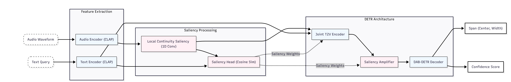

# DCASE2026 Challenge

Repository for participating in the [DCASE 2026 Challenge](https://dcase.community/) — Detection and Classification of Acoustic Scenes and Events.

## Model Architecture



LCS-DETR extends [SG-DETR](https://arxiv.org/pdf/2410.01615v1) and QD-DETR with several key mechanisms for robust audio moment retrieval:

1. **Local Continuity Saliency (LCS):** Standard DETR relies on Cross-Attention between Text and Audio tokens. Given our 2Hz sampling rate, a standard transformer layer struggles to capture fine-grained temporal dependencies. LCS introduces a lightweight 1D Convolutional layer (e.g., `Conv1D(GELU(DWConv5(A))) + A`) directly on the Audio Encoder outputs before Cross-Attention. This forces the model to learn short-term temporal continuity (like the start of a sound fading into its peak), allowing it to better "see" the shape of the sound event when attending to text.
2. **Saliency-Guided Cross Attention:** The Saliency Amplifier decouples the Transformer into `Encoder -> SaliencyAmplifier -> Decoder`. Bounding box queries directly attend to saliency-amplified features, improving semantic focus.
3. **Adaptive Positional Encoding:** We use an `adaptive` mode for Sine positional embeddings (`position_embedding: sine_adaptive`), wrapping static frequency bands in learnable parameters so the model can stretch and compress sinusoidal periods to match DCASE audio dynamics.

## Usage

The repository uses a unified CLI to trigger different pipelines. All commands should be run from the root of the project.

### 1. Training
Run the training pipeline from scratch or fine-tune from a checkpoint:
```bash
# Train from scratch
python -m src train --config config/config.yml

# Fine-tune from an existing checkpoint
python -m src train --config config/config.yml --model_path results/best_checkpoint.pth
```

### 2. Evaluation
Evaluate a trained model on a specific split (`val` or `test`):
```bash
python -m src evaluate --config config/config.yml --model_path results/best_checkpoint.pth --split test
```

### 3. Create Submission
Generate private submissions for the challenge:
```bash
python -m src create_submission --config config/config.yml --model_path results/best_checkpoint.pth
```


## Reference

```
@inproceedings{munakata2025audiomoment,
  author = {Munakata, Hokuto and Nishimura, Taichi and Nakada, Shota and Komatsu, Tatsuya},
  title = {Language-based Audio Moment Retrieval},
  booktitle = {Proc. ICASSP},
  year = {2025},
  pages = {1-5},
  _pdf = {https://arxiv.org/pdf/2409.15672}
}
```
QD-DETR citation:
```
@inproceedings{qddetr
    author = {WonJun Moon and Sangeek Hyun and SangUk Park and Dongchan Park and Jae-Pil Heo},
    title = {Query-Dependent Video Representation for Moment Retrieval and Highlight Detection},
    booktitle = {Proc. CVPR},
    year = {2023},
}
```


## Contact 

minh.leduc.0210@gmail.com