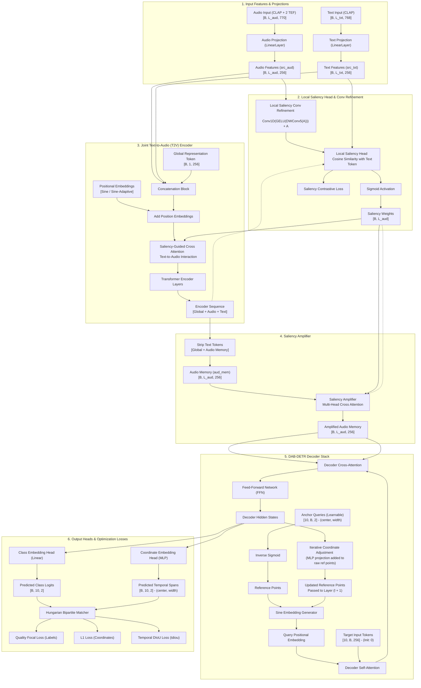

# NOTE

## 02/05/2026

- https://github.com/h-munakata/Lighthouse-Wrapper-for-Audio-Moment-Retrieval
- https://arxiv.org/pdf/2410.10140

## 04/04/2026

- The baseline is quite clear for the idea of semantic search; but it could be a situation that ... we can try to use the AST model first for segment, the embed all text query, then sim-search in those text query, and get relevant segments. => This will be my first baseline.

## ...

- Count min, max, avg no. of words in each captions => If the number is reasonable, we can use another small language model (SmolLM) to generate more augmented-captions for each audio.

## 01/06/2026 (Architecture & Positional Encoding Refactoring)

- **Fixed RoPE Crash**: Re-wrote `RotaryEmbedding` to accept `(x, mask)` and act as a 1D additive positional encoding to match the DETR architecture expectations (previously it expected multiplicative scaling, causing violent PyTorch crashes).
- **Regularized Convolutional Positional Encoding**: Added LayerNorm, GELU, and Dropout (10%) to `ConvPositionalEncoding` (`position_embedding: conv`). Previously, the raw unregularized convolutions were dominating the signal and causing extreme "v-shaped" validation curve overfitting.
- **Implemented Learnable Fourier Features**: Added an `adaptive` mode to `PositionEmbeddingSine` (`position_embedding: sine_adaptive`). It wraps the static frequency bands in an `nn.Parameter()`, allowing the optimizer to stretch and compress the sinusoidal periods to match the DCASE audio dynamics perfectly.
- **Deleted ALiBi**: Removed `alibi_pos_enc.py` as it is a relative positional penalty (modifies attention matrices based on token distances) and is conceptually incompatible with DETR's cross-attention and learnable decoder queries, which require an absolute coordinate space.
- **Fixed Saliency-Guided Amplifier (Major mAP Fix)**: Discovered that `saliency_amplifier` was completely bypassed by the Decoder. Refactored `src/models/lcs_detr/model.py` to decouple the Transformer into `Encoder -> SaliencyAmplifier -> Decoder`. Bounding box queries now directly attend to the saliency-amplified features.
- **Optimized Negative Pairs Compute**: Bypassed the heavy 6-layer Decoder during the contrastive negative pairs generation, as only the Encoder outputs (`memory_neg`) are actually used for the negative saliency score loss. Saves ~35% VRAM and computation time.

## 06/06/2026

